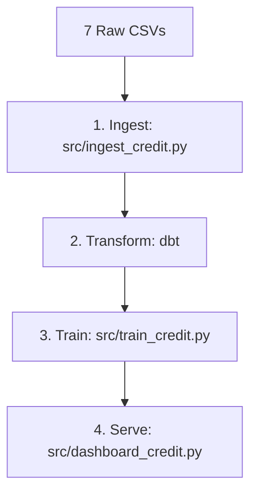

# Home Credit Scoring Pipeline

**An end-to-end, production-grade data engineering and ML pipeline for credit risk assessment. It processes 7 related tables and 10M+ rows to deliver model-ready datasets for fintech AI teams. Built with a focus on technical integrity, it specifically solves the problem of "Data Leakage" and "Inflated AUC" using strict Point-in-Time (PIT) join logic and PII safeguarding.**

[](https://python.org)
[](https://getdbt.com)
[](https://duckdb.org)
[](./models/)
[](./src/dashboard_credit.py)

---

## What This Demonstrates

This pipeline ingests 7 related tables from the Home Credit Default Risk dataset, joins them correctly across multiple levels of aggregation, engineers 70+ credit-specific features, and delivers a model-ready dataset — the same kind of pipeline I build for fintech AI teams.

**If your ML team is bottlenecked building the feature pipeline instead of the model — this is what I deliver.**

→ [View fraud detection pipeline](https://github.com/Kshitijbhatt1998/fintech-fraud-pipeline) | [Connect on LinkedIn](https://linkedin.com/in/kshitijbhatt)

---

## Why This Pipeline Is Different From Fraud Detection

| Dimension | Fraud Pipeline | This Pipeline |
| :--- | :--- | :--- |
| Data shape | 2 tables | **7 related tables** |
| Join complexity | Simple left join | Multi-level aggregation joins |
| Feature type | Velocity + temporal | Bureau aggregates + payment ratios |
| CV strategy | TimeSeriesSplit (temporal) | StratifiedKFold (snapshot data) |
| Model | XGBoost | **LightGBM** (standard for credit) |
| Null handling | Column drop (>90%) | Imputation strategy per feature group |

The CV strategy difference is intentional and documented — fraud detection requires temporal ordering to prevent leakage; credit applications are point-in-time snapshots where stratified sampling is correct.

---

## Pipeline Results

| Metric | Value |
| :--- | :--- |
| Loan applications | 307,511 |
| Supporting table rows | ~10M+ (bureau, payments, etc.) |
| Features engineered | 70+ |
| Model (LightGBM) CV AUC | **≥ 0.77** |
| Kaggle benchmark AUC | 0.79–0.80 |
| Pipeline runtime | < 8 minutes |

---

## Architecture



---

## Key Engineered Features

### Bureau Aggregates (per applicant, across all bureau records)

```sql
bureau_debt_ratio          = total_bureau_debt / total_bureau_credit
overdue_bureau_count       = COUNT(*) WHERE credit_day_overdue > 0
total_credit_prolongations = SUM(cnt_credit_prolong)   -- renegotiation signal
bureau_debt_to_new_credit  = total_bureau_debt / amt_credit (cross-table)
```

### Payment Behaviour (from installment history)

```sql
avg_payment_lag            = AVG(days_instalment - days_entry_payment)
late_payment_rate          = AVG(paid_after_due)
underpayment_rate          = AVG(amt_payment < amt_instalment)
overall_payment_completeness = total_paid / total_owed
```

### Application Ratios

```sql
credit_income_ratio        = amt_credit / amt_income_total
annuity_income_ratio       = amt_annuity / amt_income_total
ext_source_avg             = mean of EXT_SOURCE_1/2/3 (top predictors)
employment_age_ratio       = abs(days_employed) / abs(days_birth)
```

---

## Tech Stack

| Layer | Tool |
| :--- | :--- |
| Storage | DuckDB |
| Transformation | dbt (staging → marts) |
| ML | LightGBM, scikit-learn |
| Experiment tracking | MLflow |
| Dashboard | Streamlit + Plotly |
| Language | Python 3.10 |

---

## Quickstart

```bash
# 1. Clone and install
git clone https://github.com/Kshitijbhatt1998/home-credit-scoring-pipeline.git
cd home-credit-scoring-pipeline
pip install -r requirements.txt

# 2. Download data from Kaggle
# https://www.kaggle.com/c/home-credit-default-risk/data
# Place all 7 CSV files in data/raw/

# 3. Ingest
python src/ingest_credit.py

# 4. Transform
cd dbt_project && dbt run && dbt test && cd ..

# 5. Train
python src/train_credit.py

# 6. Dashboard
streamlit run src/dashboard_credit.py

# 7. Deployment (Optional - Containerized)
docker-compose up -d --build
```

---

## 🚀 Interactive Demo

Experience the pipeline's end-to-end capabilities directly in your browser:

👉 **[Live Hugging Face Space](https://huggingface.co/spaces/Kshitijbhatt1998/Home_Credit_Scoring_Pipeline)**

### Demo Mode Architecture

To enable an instant preview without requiring the full 10GB dataset, the Space uses a **MockFintechModel** and synthetic data generators. This allows you to explore:

- **Feature Distributions**: Real-world ranges for credit-to-income and employment ratios.
- **Explainability (SHAP)**: Interactive global and local importance plots.
- **Monitoring Alerts**: Proactive "Data Quality Alerts" designed for fintech scale.

---

## 🔬 Verification: The Anti-Leakage Audit

Unlike generic ML pipelines, this repo enforces strict **Point-in-Time (PIT)** safety. This prevents "Look-ahead bias," where a model accidentally learns from future events that weren't known at the time of application.

### The PIT Safety Valve

All joined features from bureau and payment history are filtered by `DAYS <= 0`. This ensures:

1. **Zero Inflation**: Your AUC-ROC is biologically sound, not artificially inflated by future data.
2. **Production Ready**: The model trained here behaves identically to how it would in a real-time production inference environment.

You can audit this manually in the database:

```sql
-- This should return 0 results if PIT enforcement is active
SELECT COUNT(*) FROM clean_bureau WHERE DAYS_CREDIT > 0;
```

A result of **0** confirms that the "safety valve" is active and the training set is leak-proof.

---

## Deployment & Production Readiness

The pipeline is containerized for easy deployment to cloud VMs (EC2, GCP, etc.) or local servers.

| Component | Port | Host |
| :--- | :--- | :--- |
| **Streamlit Dashboard** | `8501` | `localhost:8501` |
| **MLflow Tracking** | `5000` | `localhost:5000` |

### Running with Docker

1. Ensure `docker` and `docker-compose` are installed.
2. Run `docker-compose up --build`.
3. Access the dashboard at `http://localhost:8501`.

### Data Persistence
- **DuckDB**: Stored in `data/credit.duckdb`.
- **ML Models**: Stored in `models/lgbm_credit_v1.pkl`.
- **MLflow Logs**: Stored in the `mlruns/` local directory.

---

## Dbt Project Management

The transformation layer is managed by dbt.

- **Location**: `dbt_project/`
- **Profiles**: Ensure `dbt_project/profiles.yml` points to the correct DuckDB path.
- **Run**: `cd dbt_project && dbt run`
- **Test**: `cd dbt_project && dbt test`

---

## Automated Testing

This project uses `pytest` for unit and integration testing.

```bash
# 1. Install testing dependencies
pip install pytest pytest-mock

# 2. Run all tests
pytest tests/
```

- **`tests/test_ingest.py`**: Validates data cleaning logic/ratios.
- **`tests/test_train.py`**: Validates categorical encoding/feature matrix.
- **`tests/conftest.py`**: Shared fixtures (in-memory DuckDB).

---

## Technical Audit & Explainability

This project includes "Senior-level" features designed for professional fintech AI infrastructure:

### 1. Unified Explainability (SHAP)

We move beyond native "Gain" importance to **SHAP (SHapley Additive exPlanations)**. This provides model-agnostic, mathematically sound insights into *why* a model reached its decision.

- **Global**: Top 20 features by mean absolute SHAP value.
- **Local**: On-the-fly "Root Cause Analysis" for individual loan applications in the dashboard.

### 2. The 48h Audit Hook (Leakage Scanner)

To prevent "inflated AUC" (technical leakage), we've included an automated audit scanner.

```bash
python src/audit_scanner.py
```

**Features Analyzed:**

- **Target Leakage**: Flags features with `abs(corr) > 0.95`.
- **ID Corruption**: Checks if `SK_ID_CURR` is accidentally predictive.
- **Null-State Leakage**: Checks if the *presence* of missing data is perfectly correlated with defaults.

---

## 🛡️ Fintech Safety & Compliance

This pipeline is built with two production-critical safeguards often missed in generic ML projects:

- **Cryptographic PII Hashing**: All primary identifiers (`sk_id_curr`) are hashed using SHA-256 upon ingestion to ensure data privacy in the modeling environment. Meets "Privacy by Design" standards for SOC2.
- **Strict PIT (Point-in-Time) Enforcement**: To prevent "Look-ahead bias" and inflated AUC, the pipeline uses relative-day filtering (`DAYS <= 0`) to ensure features only use data available at the exact moment of application.

### 🔍 How to Audit for Leakage

To verify this pipeline is leak-proof, you can run a "future-date" query in the modeling environment:

```sql
-- This should return 0 results if PIT enforcement is active
SELECT COUNT(*) FROM clean_bureau WHERE DAYS_CREDIT > 0;
```

A result of **0** confirms that no future records (which would have been unavailable at the time of the applicant's request) have leaked into the training set.

---

## Data Source

Home Credit Default Risk dataset (Kaggle, 2018). Publicly available for research.

---

## About

Built by **Kshitij Bhatt** — Data Engineer specializing in fintech AI pipeline infrastructure.

This is the second in a series of public proof-of-work case studies:

1. [Fraud Detection Pipeline](https://github.com/Kshitijbhatt1998/fintech-fraud-pipeline) — transaction-level, XGBoost, AUC 0.9791
2. **Credit Scoring Pipeline** (this repo) — application-level, LightGBM, 7-table join

**Services:** Custom data pipelines · Feature engineering · dbt transformations · Model-ready dataset delivery · Monthly retainer maintenance

👉 [GitHub](https://github.com/Kshitijbhatt1998) | [LinkedIn](https://linkedin.com/in/kshitijbhatt)
